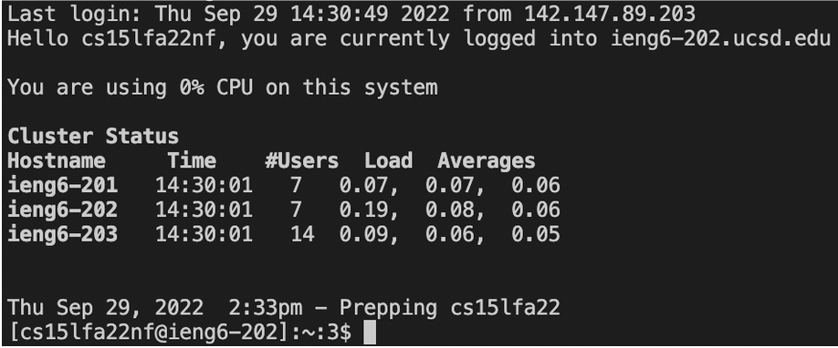

# Tutorial - Accessing `ieng6`
## Installing VScode
 the appropriate VScode for your OS from the website and install it to your system.
After the installation, the VScode should look something like below.

## Remotely Connecting
The accounts in ucsd computer labs follow the format of `cs15lfa22XX` where XX is your unique identifier.
Now, ssh into the ucsd lab systems by typing `ssh cs15lfa22XX@ieng6.ucsd.edu`, and type in the password when prompt.
The resulting screen should show something like below.

## Trying Some Commands
Try `cd`, `ls`, `pwd`, `mkdir`, and `cp`. There are some interesting outputs to be observed.
The outputs indicate the commands work based on the current host, which is the remote host you've ssh-ed into.

## Moving Files with scp
`scp` command copies files from one host to another. The syntax is as the following.
`scp <source path 1> [<source path 2> ...] <destination path>`
Copying the WhereAmI.java should show something like below.

## Setting an SSH Key
Setting up a key greatly streamlines the ssh process. Use `ssh-keygen` and press enter when prompted `Enter file in which to save the key`.
This will create create the key in the default directory which is `/Users/<currentUser>/.ssh/id_rsa`.
Then, type `ssh-copy-id -i ~/.ssh/<public_key> cs15lfa22XX@ieng6.ucsd.edu` where to copy the key into the ucsd lab host.
Alternatively you could copy the contents of the public key into `.ssh/authorized_keys` directly.
If done correctly the result should show as the following.

## Optimizing Remote Running
Now you can optimize local edits (on your computer) to reflect to the remote host (the ucsd systems).
The following oneliner will copy/compile/run the newly edited file on the remote. Saving this into a file and running it to run will save time a lot.
`scp WhereAmI.java cs15lfa22nf@ieng6.ucsd.edu; ssh cs15lfa22nf@ieng6.ucsd.edu "javac WhereAmI.java; java WhereAmI"`

