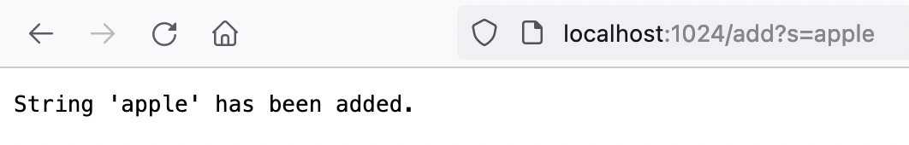
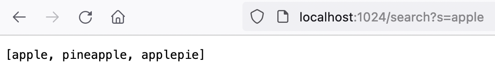
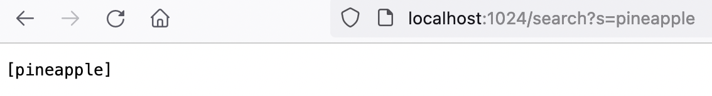

# Lab Report 2
## Part 1 - The Simplest Search Engine
```
import java.io.IOException;
import java.net.URI;
import java.util.ArrayList;
import java.util.List;

class Handler implements URLHandler {
    // This list will hold the list of strings to be added/queried
    List<String> list = new ArrayList<>();

    public String handleRequest(URI url) {
        System.out.println(url);
        if (url.getPath().equals("/")) {
            return String.format("Enter a query!");
        } else {
            System.out.println("Path: " + url.getPath());
            // /add?s=anewstringtoadd
            if (url.getPath().contains("/add")) {
                String[] parameters = url.getQuery().split("=");
                if (parameters[0].equals("s")) {
                    list.add(parameters[1]);
                    return String.format("String \'%s\' has been added.", parameters[1]);
                }
            } else if (url.getPath().contains("/search")) {
                String[] parameters = url.getQuery().split("=");
                if (parameters[0].equals("s")) {
                    List<String> fetched = new ArrayList<>();
                    for (String s: list){
                        if (s.contains(parameters[1])) fetched.add(s);
                    }
                    return fetched.toString();
                }
            }
            return "404 Not Found!";
        }
    }
}

class SearchEngine {
    public static void main(String[] args) throws IOException {
        if(args.length == 0){
            System.out.println("Missing port number! Try any number between 1024 to 49151");
            return;
        }

        if(args[0].equals("22")){
            System.out.println("Did you know that port 22 is the one used by ssh? We can't use it for a web server.");
            return;
        }

        int port = Integer.parseInt(args[0]);

        Server.start(port, new Handler());
    }
}
```

### Adding apple in the search list

Upon request url request, the handleRequest() receives the url path and stores in "url" variable. Then, it checks for the request type after the slash which is "/add". The question mark in the path signals beginning of query and getQuery() returns the query field "s=apple". The field (which is a string) gets split() which is converted into array of substrings splitted by "=", which results ["s", "apple"]. The second if statement checks to make sure "s" is the first element of the splitted list and adds the second parameter, "apple" to the list of strings to store. Lastly, return string is printed in the screen notifying the user that the string that has been added.
 
### Searching for non-unique substring

Exact same process to adding, the "/search" request is caught by the same handleRequest() method and checks for the query field "s=apple" in get.Query(). The second if statement checks to make sure "s" is the first element of the splitted list. But this time, the list variable (which is a List object) is iterated by a for each loop to check if it contains the second element of the splitted list (from the query field) and checks there are any words that contain the query as a substring. The words that do are stored in "fetched" list, and returned eventually as a string via toString(). Here we can see Apple, Pineapple, Applepie because they all contain apple as a substring.

### Searching for a unique substring

Exact same process as searching for apple, but this time we can see only a single word returns because pineapple is a unique substring that doesn't fit in another word such as apple. Once again the word is added to the "fetched" list, and returned as a string using the toString() method for the handleRequest().
    
    
## Part 2 - Failure Inducing Inputs, Symptoms and Bugs
### Array Methods - reverseInPlace()
- Input
```
int[] input3 = { 3, 4, 5 };
ArrayExamples.reverseInPlace(input3);
assertArrayEquals(new int[]{ 5, 4, 3 }, input3);
```
- Symptom
```
JUnit version 4.13.2
.E
Time: 0.003
There was 1 failure:
1) testReverseInPlace(ArrayTests)
arrays first differed at element [1]; expected:<3> but was:<4>
        at org.junit.internal.ComparisonCriteria.arrayEquals(ComparisonCriteria.java:78)
        at org.junit.internal.ComparisonCriteria.arrayEquals(ComparisonCriteria.java:28)
        at org.junit.Assert.internalArrayEquals(Assert.java:534)
        at org.junit.Assert.assertArrayEquals(Assert.java:418)
        at org.junit.Assert.assertArrayEquals(Assert.java:429)
        at ArrayTests.testReverseInPlace(ArrayTests.java:13)
        ... 32 trimmed
Caused by: java.lang.AssertionError: expected:<3> but was:<4>
        at org.junit.Assert.fail(Assert.java:89)
        at org.junit.Assert.failNotEquals(Assert.java:835)
        at org.junit.Assert.assertEquals(Assert.java:120)
        at org.junit.Assert.assertEquals(Assert.java:146)
        at org.junit.internal.ExactComparisonCriteria.assertElementsEqual(ExactComparisonCriteria.java:8)
        at org.junit.internal.ComparisonCriteria.arrayEquals(ComparisonCriteria.java:76)
        ... 38 more
FAILURES!!!
Tests run: 1,  Failures: 1
```
- Bugs
```
int temp;
for(int i = 0; i < arr.length/2; i += 1) {
  temp = arr[i];
  arr[i] = arr[(arr.length-1) - i];
  arr[(arr.length-1) - i] = temp;
}
```
- Symptom explained by Bug: Last element is 5 because the first element didn't get swapped but rather got deleted while getting assign the last element. It is fixable by adding a temporary holding variable to use it for swapping.```

### List Methods
- Input
```
@Test 
public void testPrepend() {
    LinkedList list = new LinkedList();
    list.append(0);
    list.append(1);
    list.append(2);
    assertEquals(0, list.root.value);
}
```
- Symptom: Infinite loop upon adding 3rd element.
```
JUnit version 4.13.2
.E
Time: 0.743
There was 1 failure:
1) testPrepend(LinkedListTests)
org.junit.runners.model.TestTimedOutException: test timed out after 500 milliseconds
        at app//LinkedList.append(LinkedListExample.java:43)
        at app//LinkedListTests.testPrepend(LinkedListTests.java:10)
FAILURES!!!
Tests run: 1,  Failures: 1
```
- Bugs: The node adding line should be written outside the while loop.
```
while(n.next != null) {
    n = n.next;
}
n.next = new Node(value, null);
```
- Symptom explained by Bug: If the element is more than 2, the while loop enters but it adds a new node at every iteration..!!
