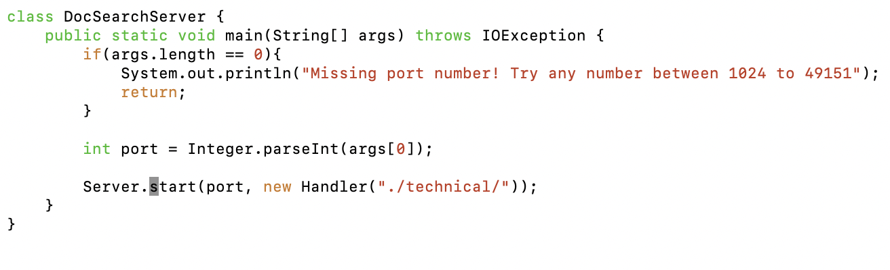
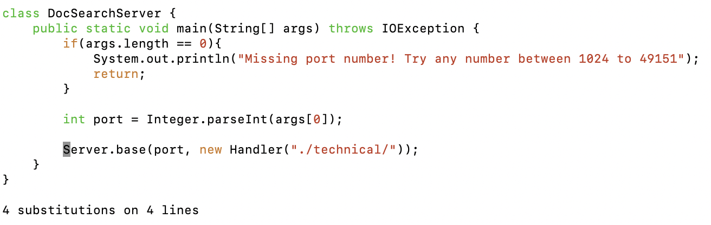

# Lab Report 4
## Part 1 - Vim Tasks
Chosen task was "Changing the name of the start parameter and its uses to base".  
We will use the global replacement command in `:%s/<old>/<new>/g` format.
>The "s" stands for substitute, and substitutes first instance of <old> text to <new> text. 
>The "g" stands for global, and makes substitution occur for every instance of the line. 
>The "%" is a range specifier that referes to the 'entire contents of the file'. 
>Putting this all together, `:%s/start/base/g` substitutes every instance of "start" to "base" for the entire line for the entire file.

Below are the keystrokes.

`:` `%` `s` `/` `s` `t` `a` `r` `t` `/` `b` `a` `s` `e` `/` `g` `:` `w` `q`

---
**Before typing the command, the search shows 4 instances of "start" within the code.**

---
**After the full command, it replaced all 4 of the instances of "start" within the code. No other mid changes were made.**

## Part 2 - Comparing direct VIM vs. indirect VSCode+SCP
Chosen task was "rename the new test to testSearchCount2 and change the query string being tested to tax rather than taxation". 
> It took `2:06` minutes with VScode locally and SCPing, and `1:05` minutes with VIM on remote.

* Which of these two styles would you prefer using if you had to work on a program that you were running remotely, and why?
  >Even if the program were to run remotely, I would still prefer VScode because it allows me more functionality and I am more accustomed to it.
For minor edits, however, I'd rather prefer vim.

* What about the project or task might factor into your decision one way or another?   (If nothing would affect your decision, say so and why!)
  >If the project involves lots of coding and planning, I would rather port the files locally and work on my own system. However, if the project involves few lines of codes or edits, I would rather have VIM open and work directly from there.
