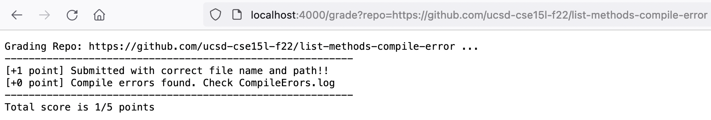
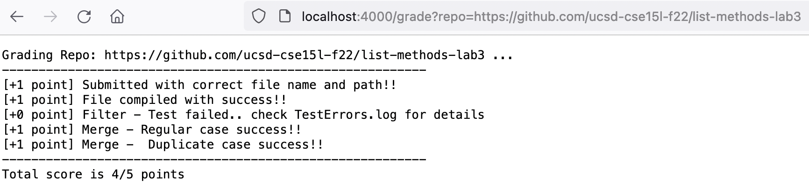
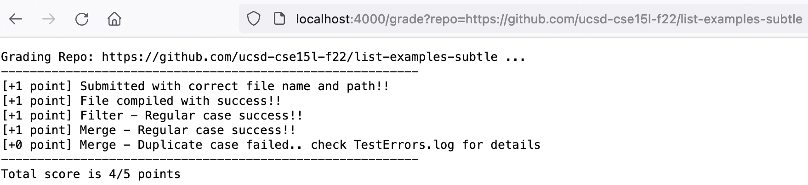

# Lab Report 5
## `grade.sh`
```
# Create your grading script here
# set -e

rm -rf student-submission           # Clears previous submission
git clone $1 student-submission     # Clones new submission to local

echo "Grading Repo: $1 ..."
echo '----------------------------------------------------------'
SCORE=0;
JPATH='.:lib/hamcrest-core-1.3.jar:lib/junit-4.13.2.jar'
# javac -cp $JUPATH TestListExamples.java
if [[ -e student-submission/ListExamples.java ]]; then
    echo '[+1 point] Submitted with correct file name and path!!'
    SCORE=$(( SCORE + 1 ))
    cp student-submission/ListExamples.java .
    echo > CompileErrors.log # Clears log from previous if it exists
    echo > TestErrors.log    # Clears log from previous if it exists
    javac -cp $JPATH ListExamples.java TestListExamples.java 2> CompileErrors.log
    if [[ $? -eq 0 ]]; then
        SCORE=$(( SCORE + 1 ))
        echo '[+1 point] File compiled with success!!'
        java -cp $JPATH org.junit.runner.JUnitCore TestListExamples 1> TestErrors.log
        if grep -q 'testFilter' TestErrors.log; then
            echo '[+0 point] Filter - Test failed.. check TestErrors.log for details'
        else
            SCORE=$(( SCORE + 1 ))
            echo '[+1 point] Filter - Regular case success!!'
        fi
        if grep -q 'testMergeReg' TestErrors.log; then
            echo '[+0 point] Merge - Regular case failed.. check TestErrors.log for details'
        else
            SCORE=$(( SCORE + 1 ))
            echo '[+1 point] Merge - Regular case success!!'
        fi
        if grep -q testMergeDupe TestErrors.log; then
            echo '[+0 point] Merge - Duplicate case failed.. check TestErrors.log for details'
        else
            SCORE=$(( SCORE + 1 ))
            echo '[+1 point] Merge -  Duplicate case success!!'
        fi
    else
        echo '[+0 point] Compile errors found. Check CompileErors.log'
    fi
else
    echo '[+0 point] File not found, expected path is: student-submission/ListExamples.java'
fi
echo '----------------------------------------------------------'
echo "Total score is ${SCORE}/5 points"

rm -f ListExamples.java   # Removes copied java file
```

## Repos Tested by Autograder
### 1. Compile Error (`list-methods-compile-error`)

---
**Syntax error within script halts further testing.**


### 2. Filter Error (`list-methods-lab3`)

---
**Code appends to front instead of back, resulting a different list**


### 3. Merge Error (`list-examples-subtle`)

---
**Duplicate cases aren't considered for the implementation**


## Trace for `list-methods-compile-error`

`rm -rf student-submission`
> **stdout**: none, **stderr**: none, **return**: 0

`git clone $1 student-submission`
> **stdout**: none, **stderr**: Cloning into 'student-submission'..., **return**: 0

`echo "Grading Repo: $1 ..."`
> **stdout**: Grading Repo: https://github.com/ucsd-cse15l-f22/list-methods-compile-error ..., **stderr**: none, **return**: 0

`echo '----------------------------------------------------------'`
> **stdout**: ----------------------------------------------------------, **stderr**: none, **return**: 0

`if [[ -e student-submission/ListExamples.java ]]; then`
> **True**, correct file name copied from list-methods-compile-error/ListExamples.java <br> **stdout**: none, **stderr**: none, **return**: 0

`echo [+1 point] Submitted with correct file name and path!!`
> **stdout**: [+1 point] Submitted with correct file name and path!!, **stderr**: none, **return**: 0

`cp student-submission/ListExamples.java .`
> **stdout**: none, **stderr**: none, **return**: 0

`echo > CompileErrors.log`
> **stdout**: none, **stderr**: none, **return**: 0

`echo > TestErrors.log`
> **stdout**: none, **stderr**: none, **return**: 0
    
`javac -cp $JPATH ListExamples.java TestListExamples.java`
> **stdout**: none <br> **stderr**: 
```
ListExamples.java:15: error: ';' expected
        result.add(0, s)
                        ^
1 error
```
>**return**: 1

`if [[ $? -eq 0 ]]; then`
> **False**, javac returned 1 (non zero) return code <br> **stdout**: none, **stderr**: none, **return**: zero

```
echo '[+1 point] File compiled with success!!'
java -cp $JPATH org.junit.runner.JUnitCore TestListExamples 1> TestErrors.log
        if grep -q 'testFilter' TestErrors.log; then
            echo '[+0 point] Filter - Test failed.. check TestErrors.log for details'
        else
            SCORE=$(( SCORE + 1 ))
            echo '[+1 point] Filter - Regular case success!!'
        fi
        if grep -q 'testMergeReg' TestErrors.log; then
            echo '[+0 point] Merge - Regular case failed.. check TestErrors.log for details'
        else
            SCORE=$(( SCORE + 1 ))
            echo '[+1 point] Merge - Regular case success!!'
        fi
        if grep -q testMergeDupe TestErrors.log; then
            echo '[+0 point] Merge - Duplicate case failed.. check TestErrors.log for details'
        else
            SCORE=$(( SCORE + 1 ))
            echo '[+1 point] Merge -  Duplicate case success!!'
        fi
```
> **This block doesn't run due to false condition from if above.**

`echo '[+0 point] Compile errors found. Check CompileErors.log'`
> **stdout**: [+0 point] Compile errors found. Check CompileErors.log, **stderr**: none, **return**: zero

```
else
    echo '[+0 point] File not found, expected path is: student-submission/ListExamples.java'
fi
```
> **This block doesn't run due to false condition from if above.**

`echo '----------------------------------------------------------'`
> **stdout**: ----------------------------------------------------------, **stderr**: none, **return**: zero

`echo "Total score is ${SCORE}/5 points"`
> **stdout**: Total score is 1/5 points, **stderr**: none, **return**: zero

`rm -f ListExamples.java`
> **stdout**: none, **stderr**: none, **return**: zero
